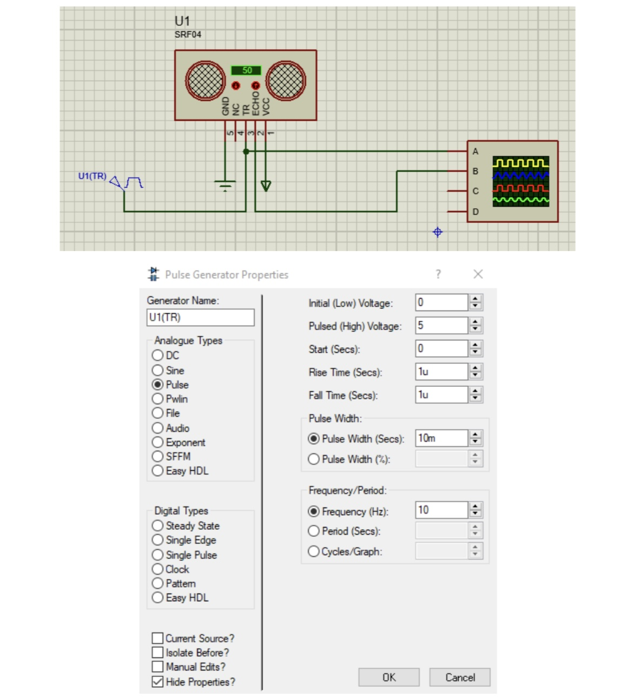
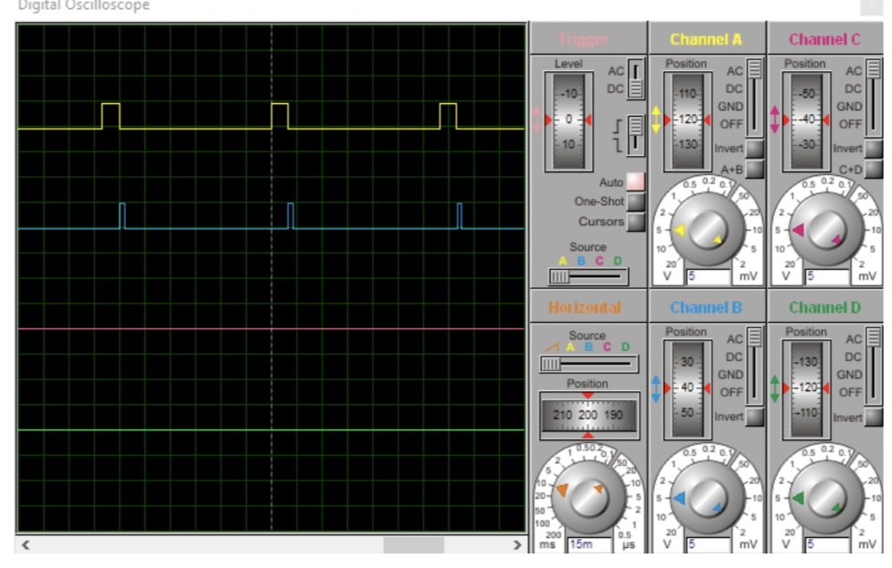
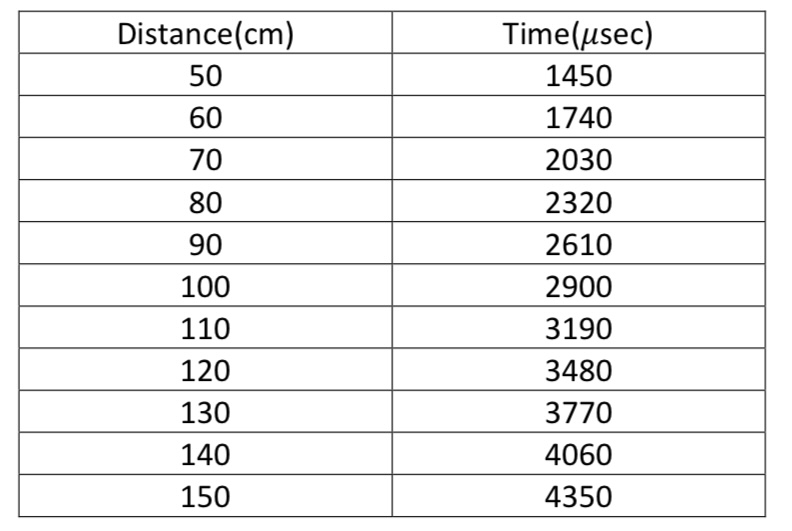
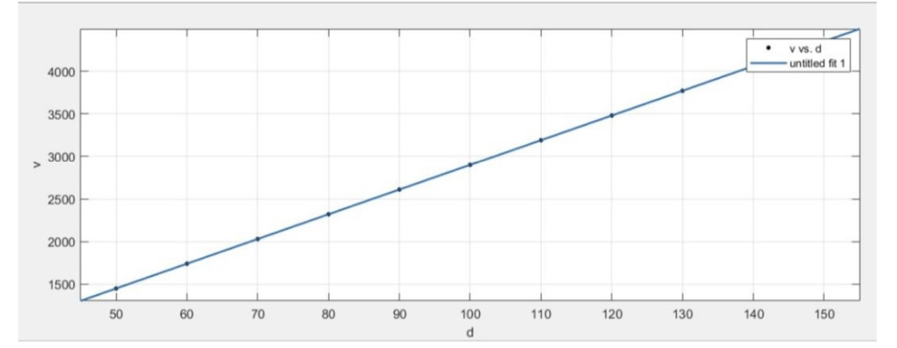
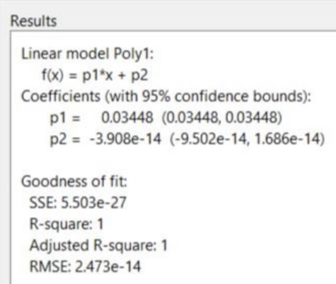
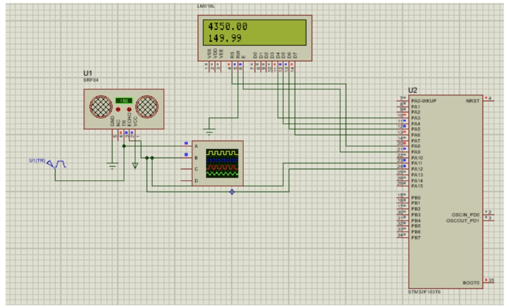

# Ultrasonic_Distance_Sensor
Printing the **ultrasonic distance** measured by a **SRF04** sensor on an LCD connected to a **STM32** micro-controller.

For this project, I used a SRF04 sensor, and connected the **TR pin** to a **pulse signal** with a 5v amplitude, and a 100 ms period time. 

The **TR** and **ECHO** signals can be viewed on the **oscilloscope** as follows:

By using the knowledge that the pulse width of the ECHO signal is the **back and forth time** of the ultrasonic signal to a certain distance, we can use a micro-controller to find the forth-time of the signal.

First, I created a table for different forth times corresponding to **different distances** that the ultrasonic signal travels:

Then, by using the **cftool** in MATLAB, I fit the **best curve** possible to the data:

The equation of the curve is as follows:

By using the equation above, and using a **STM32 micro-controller**, I wrote a program to measure the ultrasonic distance with the sensor, and print the result on an lcd connected to the micro-controller.

The final result:

